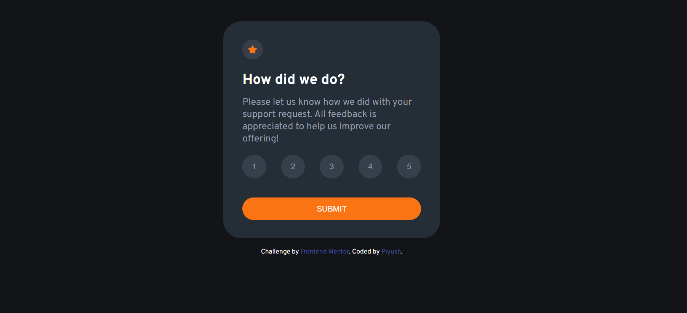

# Rating Feedback Form
This is a simple web page that allows users to provide feedback by rating a service. Users can select a rating between 1 and 5, and their selected rating is displayed in a "Thank You" message.

## Table of contents

- [Overview](#overview)
  - [The challenge](#the-challenge)
  - [Features](#features)
  - [Screenshot](#screenshot)
  - [Demo-Links](#links)
- [My process](#my-process)
  - [Built with](#built-with)
  - [What I learned](#what-i-learned)
  - [Useful resources](#useful-resources)
- [Author](#author)

## Overview

### The challenge

Users should be able to:

- View the optimal layout for the app depending on their device's screen size
- See hover states for all interactive elements on the page
- Select and submit a number rating
- See the "Thank you" card state after submitting a rating

### Features

- Users can select a rating between 1 and 5.
- The selected rating is displayed in a "Thank You" message.
- Responsive design for various screen sizes.

### Screenshot

### Demo-Links

- Solution URL: [Solution URL here]()
- Live Site URL: [Live site URL here]()

## My process

### Built with

- Semantic HTML5 markup
- CSS custom properties
- FlexBox
- JavaScript - Document Object Model 

### What I learned

In the process of building this project, I learned:

1. How to create a simple web page with HTML, CSS, and JavaScript.
2. How to use event listeners to capture user interactions.
3. How to manipulate the DOM to display dynamic content.
4. How to use forEach().
5. How to apply CSS styles for a responsive design.

### Useful resources

- Add a class to one and only one element from an HTML list on click - (https://stackoverflow.com/questions/62558082/add-a-class-to-one-and-only-one-element-from-an-html-list-on-click)

- JavaScript click event listener on class -v (https://stackoverflow.com/questions/19655189/javascript-click-event-listener-on-class)

## Author

- Frontend Mentor - [@Neooo17](https://www.frontendmentor.io/profile/Neooo17)
- Website - [Neooo17](https://github.com/Neooo17)
